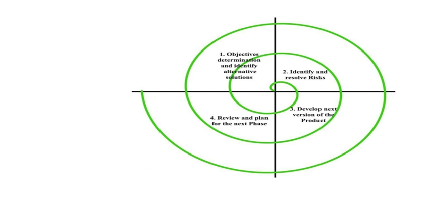
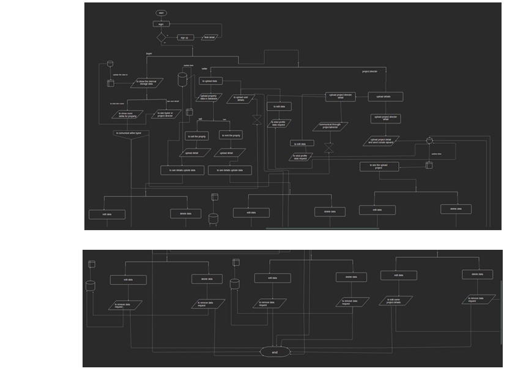
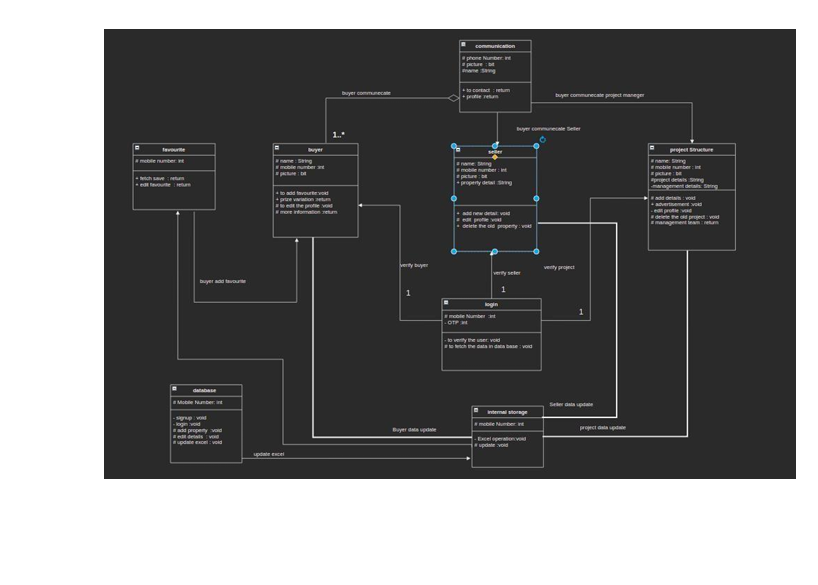
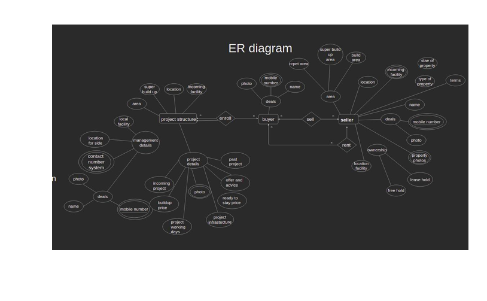
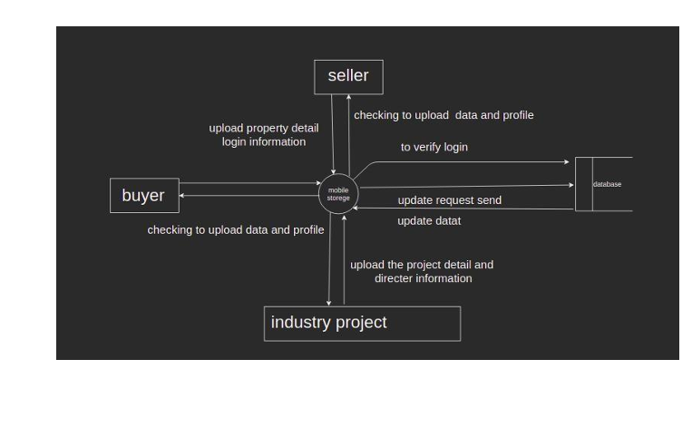
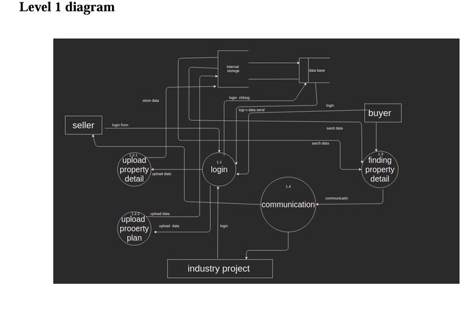
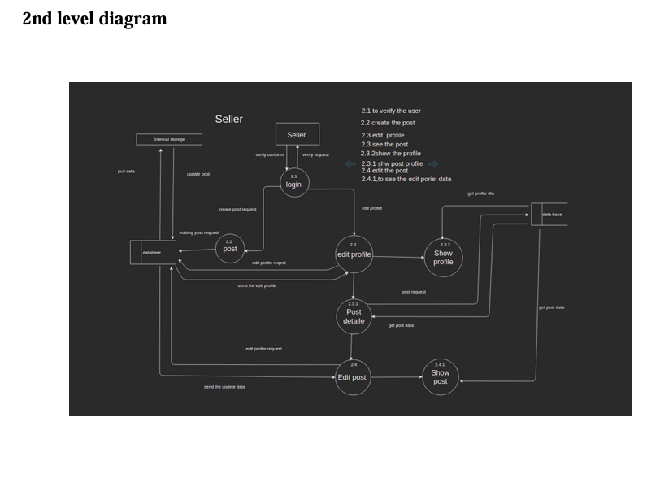
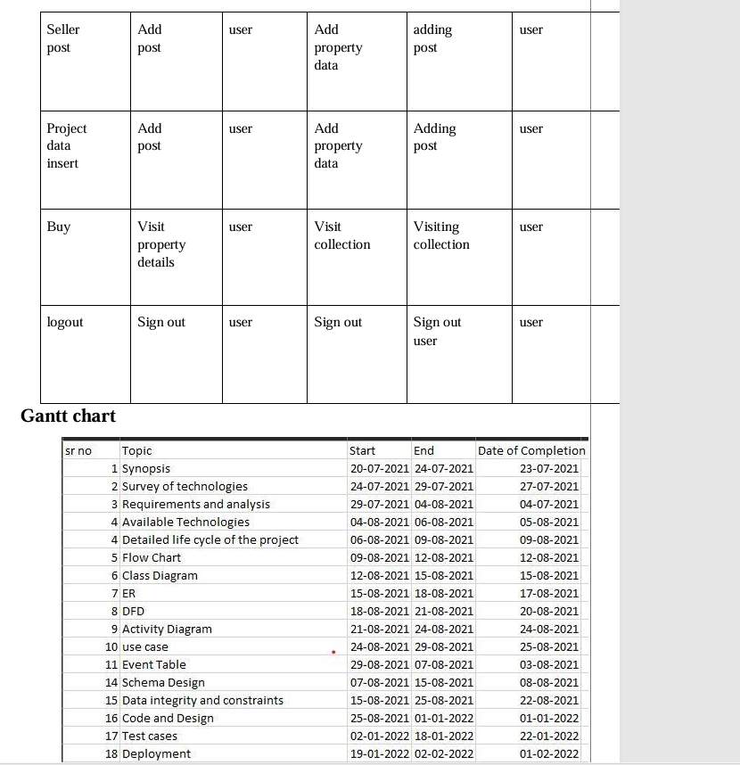
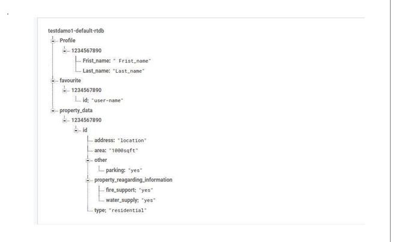

# BrokFree Android App – Broker Free Property Marketplace

## Project Overview
BrokFree is an Android-based property marketplace application designed to help users buy, sell, and rent properties without involving brokers or paying brokerage fees.

The application provides a platform where buyers and sellers can directly communicate with each other, compare property prices, and explore various property categories including residential, commercial, and slum redevelopment areas.

The project also introduces the concept of AI/ML-based property price prediction using nearby facilities, location, infrastructure, and government regulation data.

---

## Problem Statement
Traditional real-estate platforms often involve:
- brokerage commissions
- lack of pricing transparency
- scam risks
- communication barriers
- limited direct interaction between buyers and sellers

This project aims to create a broker-free and transparent property management system that allows users to directly connect and make better property decisions.

---

## Objectives

- Develop a broker-free property marketplace
- Allow users to buy, sell, and rent properties
- Enable direct buyer-seller communication
- Provide property filtering and locality search
- Implement real-time cloud database support
- Introduce AI-based property price prediction concepts
- Reduce property scams and unnecessary brokerage costs

---

## Key Features

### Property Marketplace
- Buy properties
- Sell properties
- Rent properties

### Smart Property Search
- Search by locality
- Filter properties by category
- Explore nearby facilities

### Real-Time Communication
- Direct buyer-seller interaction
- Reduced dependency on brokers

### Cloud Database Integration
- Firebase Realtime Database
- Real-time data updates
- Cloud storage support

### AI-Based Price Prediction Concept
- Property price comparison
- Government regulation-based pricing
- Location and nearby facility analysis
- Future infrastructure impact consideration

---

## Technologies Used

### Frontend
- XML
- Android UI Components

### Backend
- Java

### Database
- Firebase Realtime Database
- Firebase Authentication

### Development Tools
- Android Studio
- Google Firebase
- Google Colab

### Additional Concepts
- Machine Learning
- NoSQL Database Architecture
- UML Design
- System Analysis & Design

---

## Software Requirements

- Android Studio
- Java SDK
- Firebase Integration
- Android Emulator / Android Device

---

## Hardware Requirements

- Android Smartphone
- Minimum 2GB RAM
- Internet Connection
- GPS / Geolocation Support

---

## System Design & Architecture

### Spiral Development Model
The project follows the Spiral Model SDLC approach for:
- iterative development
- risk analysis
- continuous improvement
- validation and testing

---

## System Design Diagrams

### Spiral Development Model

---

### System Flowchart

---

### UML Class Diagram

---

### Entity Relationship Diagram

---

### Context Level DFD

---

### Level 1 DFD

---

### Level 2 DFD

---

### Activity Diagram

---

### Gantt Chart

---

### NoSQL Database Architecture

---

## Database Design

The application uses Firebase NoSQL Database architecture to manage:
- user accounts
- property listings
- authentication
- property details
- real-time updates
- buyer-seller communication

---

## Machine Learning Concept

The project introduces the concept of property price prediction using:
- property area
- nearby facilities
- government regulations
- locality
- infrastructure developments
- category of property

The ML concept helps users estimate better property prices and make informed decisions.

---

## Advantages of the System

- Broker-free property transactions
- Direct communication between users
- Real-time property updates
- Reduced fraud and scam risks
- Property comparison support
- Location-based search
- Better pricing transparency

---

## Team Contribution

This project was completed as part of a group academic project.

### My Contributions
- Requirement Analysis
- System Design
- UML & DFD Diagram Design
- Firebase Database Understanding
- Documentation
- Feature Planning
- Application Workflow Analysis
- Architecture Design

---

## Skills Demonstrated

- Android Application Concepts
- System Analysis & Design
- Database Design
- Firebase Integration
- UML Modeling
- DFD Design
- Software Development Lifecycle (SDLC)
- Requirement Gathering
- NoSQL Database Understanding
- Product & Business Analysis

---

## Future Improvements

- Real-time chat system
- Integrated payment gateway
- AI-powered recommendation engine
- Property image recognition
- Interactive maps integration
- Advanced ML-based price prediction
- Push notifications
- Property loan integration

---

## Conclusion

The BrokFree Android App project successfully demonstrates a broker-free real-estate platform that improves transparency, reduces brokerage costs, and enables direct communication between buyers and sellers.

The project combines Android development concepts, Firebase cloud database integration, UML-based system design, and machine learning concepts to create a scalable and practical real-estate solution.

---

## Author
### Raj Verma

Business & Data Analytics Enthusiast

---

## References

- Firebase Documentation
- Android Studio Documentation
- Java Documentation
- UML Design Concepts
- NoSQL Database Concepts
